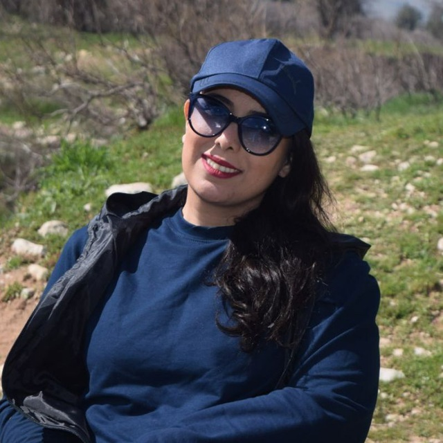

# Hi, Welcome to my Webpage

### I am interested in mathematics and philosophy of mathematics.
### I’m currently learning Structuralism in the philosophy of mathematics.
I’m also interested in the following topics: Functional Analysis, Equilibrium Problems and Fixed Point Theory.  
# CV
## Download English or persian version.
### My friend is [Rouholah](http://rhoseininaveh.github.io)

